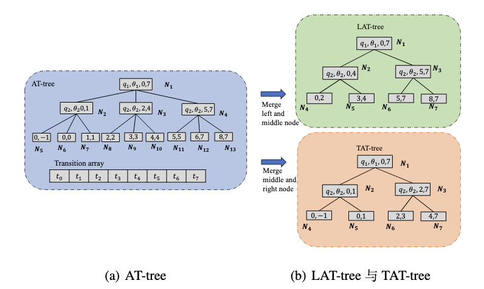
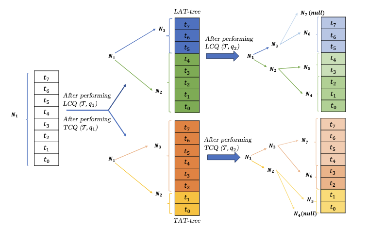

## 哈尔滨工业大学毕业设计代码实现


本研究提出两类新型线性轨迹覆盖查询：严格覆盖查询（TCQ）与宽松覆
盖查询（LCQ）。TCQ 要求查询轨迹的起点与终点均在指定距离阈值内，适用于识别高度相似路径；LCQ 则只需起点或终点之一满足条件，适于发现潜在的换乘轨迹。为防止隐私泄露，我们引入差分隐私机制，在保障隐私的同时保留数据的分析价值。为提升查询效率，我们设计了自适应轨迹树（AT-tree），一种基于历史查询结果增量构建的三叉索引结构，通过覆盖关系优化分裂策略，降低后续查询开销。同时，我们提出针对 LCQ 和 TCQ 优化的索引变体——LAT-tree 与 TAT-tree，并引入多种增强策略，如优化裂分逻辑和提升树的平衡性，以应对大规模数据处理带来的挑战，确保在动态查询环境下的高效与鲁棒。在真实轨迹数据集上的实验表明，AT-tree 及其变体在查询效率、可扩展性和实用性方面表现优异。差分隐私机制在不同预算设置下均有效保护用户隐私，实现了查询精度与隐私保护的良好平衡。






### Quick Start

使用`idea`打开项目运行Main即可，环境为jdk20

```shell
Usage: java Main <dataSetIndex> <q_theta> <crackBound> <algo_index> <last_time> <select_query> <epsilon>
```


### 文件结构

```
.
├── DataSet
│   ├── 202402-divvy-tripdata - 全部.csv
│   ├── 202402-divvy-tripdata-time.csv
│   ├── 202402-divvy-tripdata.csv
│   ├── 202403-capitalbikeshare-tripdata-time.csv
│   ├── 202403-capitalbikeshare-tripdata.csv
│   ├── Readme.md
│   ├── chicago_taxi_trip_mouth1.csv
│   └── combined_chicago_taxi_trip.csv
├── README.md
├── adaptive.md
├── assets
│   ├── image-20250505192038493.png
│   └── image-20250505192132044.png
├── buildTime.py
├── graduationProject.iml
├── out
│   ├── artifacts
│   └── production
├── outputData
│   ├── cracking_bound_time_0.csv
│   ├── cracking_bound_time_1.csv
│   ├── lastTime_time_0.csv
│   ├── lastTime_time_1.csv
│   ├── querynums_time_0.csv
│   ├── querynums_time_1.csv
│   ├── theta_time_0.csv
│   └── theta_time_1.csv
├── pastOutputData
│   ├── Correct_Filtered_Query_Numbers_Data.csv
│   ├── output_file.csv
│   ├── output_file_lcq_tcq.csv
│   ├── output_file_lcq_tcq_buildTime.csv
│   ├── output_file_lcq_tcq_crackbound - 副本.csv
│   ├── output_file_lcq_tcq_crackbound.csv
│   ├── output_file_lcq_tcq_theta.csv
│   ├── query_nums.csv
│   ├── query_nums_lcq_tcq.csv
│   ├── query_nums_lcq_tcq_sc.csv
│   └── test2.py
├── plot.py
├── pom.xml
├── src
│   ├── ATtree
│   ├── Algorithm.java
│   ├── Algorithm_Time.java
│   ├── DataProcess.java
│   ├── Enhancement.java
│   ├── META-INF
│   ├── Main.java
│   └── objects
├── target
│   ├── classes
│   └── generated-sources
├── test.ipynb
├── test.py
├── test2.py
├── test_time.py
└── trajectory-privacy.iml
```

